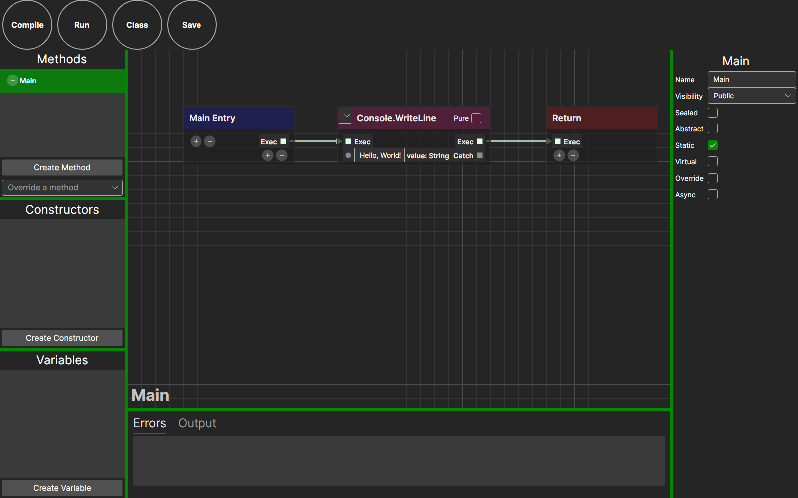

[](https://github.com/danielmeza/netprints/actions/workflows/ci.yml)
[](LICENSE)

NetPrints is a visual, node-based programming language for .NET, in the spirit of Unreal Engine's
Blueprints. You wire up nodes instead of writing C# by hand, and NetPrints compiles the graph into
a .NET binary or into C# source you can read, keep and build on. Any .NET assembly — Framework,
Core or Standard — can be referenced and used from a graph, so the goal is: if it's made in C#, you
can call it from NetPrints.

This fork continues the [original NetPrints](https://github.com/RobinKa/netprints) by
[Robin Kahlow](https://github.com/RobinKa) (WPF, Windows-only) as a cross-platform, Linux-first
rewrite on [Avalonia](https://avaloniaui.net/): the same editor and language on Linux, Windows and
macOS, on the current .NET 10, with an automated test suite (headless UI tests plus end-to-end
tests against the real desktop app) instead of manual verification.

<p align="center">
  
</p>

## Getting started

Requirements: the [.NET 10 SDK](https://dotnet.microsoft.com/download) (10.0.100 or later —
`global.json` rolls forward to newer feature bands). Everything below runs on Linux, Windows and
macOS; the commands are identical.

Build and test (no display server needed):

```bash
dotnet build NetPrints.slnx -c Release
dotnet test --solution NetPrints.slnx -c Release --no-build
```

Run the editor:

```bash
dotnet run --project src/NetPrints.Desktop -c Release -- samples/HelloWorld/HelloWorld.netpp
```

Compile and run a project from the command line:

```bash
dotnet run --project src/NetPrints.Cli -c Release -- -p samples/HelloWorld/HelloWorld.netpp -r
# → "Compilation succeeded." then the program prints "Hello, World!"
```

Run the desktop end-to-end suite (Linux, drives the real editor over X11 with a private Xvfb
display — installs `xvfb openbox xdotool imagemagick x11-utils libgtk-3-0t64 adwaita-icon-theme`
first):

```bash
NETPRINTS_E2E=1 dotnet test --project tests/NetPrints.Desktop.E2ETests
```

See [`specs/001-modernize-build/quickstart.md`](specs/001-modernize-build/quickstart.md) for the
full walkthrough (individual test projects, snapshot baselines, CI artifacts, troubleshooting).

## Using the editor

Add references from **References → Add Assembly**: any NuGet package installed to
`~/.nuget/packages` (or `%UserProfile%/.nuget/packages` on Windows) works, and its documentation
shows up as tooltips in the node search. You can also add a C# source directory, either for
reflection only (handy for using NetPrints inside Unity against your existing scripts) or compiled
straight into the output.

Projects created by the original WPF editor reference .NET Framework 4.5 reference assemblies.
When those aren't installed (for example on Linux), NetPrints falls back to the currently running
.NET runtime's own assemblies for reflection and compilation, and starts compiled executables
through the `dotnet` host. Proper reference-pack and target selection is tracked on the roadmap
(P1).

## Project layout

| Path | Contents |
|---|---|
| `src/NetPrints.Core` | The node graph model, C# translation and Roslyn compilation. No UI. |
| `src/NetPrints.Reflection` | UI-free type reflection used by the editor. |
| `src/NetPrints.Editor` | The Avalonia 12 editor library: views, view models, services. |
| `src/NetPrints.Desktop` | The desktop application hosting the editor. |
| `src/NetPrints.Cli` | The command-line compiler. |
| `tests/` | `NetPrints.Core.Tests`, `NetPrints.Editor.Tests` and `NetPrints.Editor.UITests` (xUnit v3 on Microsoft.Testing.Platform; the UI tests are headless Avalonia), `NetPrints.Desktop.E2ETests` (real editor over X11) and `NetPrints.Testing.Ui` (shared page objects). |
| `samples/` | Sample `.netpp`/`.netpc` projects used as test fixtures and quick-start material. |
| `legacy/NetPrintsVSIX` | The old Visual Studio extension, kept for reference. Not built, not tested, not in the solution (see [its README](legacy/NetPrintsVSIX/README.md)). |
| `specs/`, `docs/`, `.specify/` | [Spec Kit](https://github.com/github/spec-kit) feature specs, research notes and architecture decision records ([`docs/adr`](docs/adr)). |

Every `src/`/`tests/` project targets `net10.0`. Package versions are centrally managed in
[`Directory.Packages.props`](Directory.Packages.props); shared build settings are in
[`Directory.Build.props`](Directory.Build.props) (and the `src/`/`tests/`-scoped copies). The
[CI workflow](.github/workflows/ci.yml) builds, formats-checks, tests and runs the E2E suite on
every push and pull request.

## Status and roadmap

Under active, phased modernization — see
[`.specify/memory/roadmap.md`](.specify/memory/roadmap.md) for what's shipped and what's next.
The Avalonia editor rebuild (P0) and its GPU/CPU grid rendering (P0.1) are merged; core refactor
and extension points, a catalog/CLI redesign, and editor usability are the phases ahead.

## Contributing

See [`CONTRIBUTING.md`](CONTRIBUTING.md) for the Spec Kit workflow, agent rules, PR process and
test conventions. Bug reports and feature ideas are welcome as issues.

## Credits and license

Originally created by [Robin Kahlow](https://github.com/RobinKa)
([`RobinKa/netprints`](https://github.com/RobinKa/netprints)). The 0.0.7 WPF editor release is
archived [here](https://github.com/RobinKa/netprints/releases/tag/0.0.7); see also the
[overview](https://github.com/RobinKa/netprints/wiki/Overview),
[use cases](https://github.com/RobinKa/netprints/wiki/Use-cases) and
[hello-world video](https://youtu.be/s4M-WOlGEFk) from the original project, and the
[Unity tutorial](https://github.com/RobinKa/NetPrintsUnityTutorial).

Licensed under the [MIT License](LICENSE), Copyright (c) 2018 Robin Kahlow.
