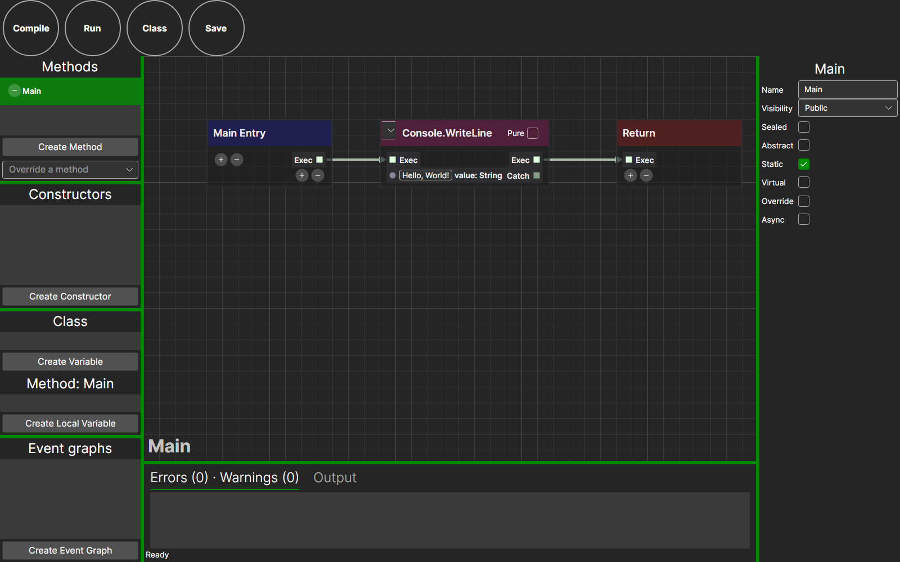

[](https://github.com/danielmeza/netprints/actions/workflows/ci.yml)
[](https://github.com/danielmeza/netprints/releases)
[](https://www.nuget.org/packages/NetPrints.Sdk)
[](https://danielmeza.github.io/netprints/)
[](LICENSE)

NetPrints is a visual, node-based programming language for .NET, in the spirit of Unreal Engine's
Blueprints. You wire up nodes instead of writing C# by hand, and NetPrints compiles the graph into
a .NET binary or into C# source you can read, keep and build on. Any .NET assembly — Framework,
Core or Standard — can be referenced and used from a graph, so the goal is: if it's made in C#, you
can call it from NetPrints.

This fork continues the [original NetPrints](https://github.com/RobinKa/netprints) by
[Robin Kahlow](https://github.com/RobinKa) (WPF, Windows-only) as a cross-platform, Linux-first
rewrite on [Avalonia](https://avaloniaui.net/): the same editor and language on Linux, Windows and
macOS, on the current .NET 10, with an automated test suite (headless UI tests plus end-to-end
tests against the real desktop app) instead of manual verification.

<p align="center">
  
</p>

## Install

| | |
|---|---|
| **Editor** | Download a build from the [latest release](https://github.com/danielmeza/netprints/releases/latest) for Linux, Windows or macOS and unpack it. Requires the [.NET 10 SDK](https://dotnet.microsoft.com/download) to open and build projects. Builds are unsigned — see the [install guide](docs/guide/install.md) for the SmartScreen/*Open Anyway* steps and checksum verification. |
| **Command-line tool** | `dotnet tool install -g NetPrints.Cli`, then `netprints build MyApp.csproj` or `netprints run MyApp.csproj` |
| **In a project** | `dotnet add package NetPrints.Sdk` |

See the [full install guide](docs/guide/install.md) for details on each route, the SDK/runtime
requirement, and verifying an unsigned build.

## Using the editor

Add references from **References → Add Assembly**: any NuGet package installed to
`~/.nuget/packages` (or `%UserProfile%/.nuget/packages` on Windows) works, and its documentation
shows up as tooltips in the node search. You can also add a C# source directory, either for
reflection only (handy for using NetPrints inside Unity against your existing scripts) or compiled
straight into the output.

## Ship nodes with your library

Annotations are optional. Any library works in NetPrints without them; the editor reads its public API directly. If you want to choose which members become nodes and ship a curated catalog inside your library, add the `NetPrints.Annotations` package (`PrivateAssets="all"`) and mark the public types and methods with `[NetPrintsType]` and `[NetPrintsNode]` attributes. The Roslyn generator embeds the catalog as an assembly attribute, which the editor reads from any referenced assembly. See the [Annotations guide](docs/guide/catalogs.md#annotations) for details.

## Guides

- [Projects](docs/guide/projects.md) — the `.csproj` project model, the `NetPrints.Sdk` package and the committed generated code.
- [Graph file format](docs/guide/graph-format.md) — the `*.netpc.json` format, version control and what a diff looks like.
- [Extensions](docs/guide/extensions.md) — loading extensions, environment variables, and writing your own.
- [Type catalogs](docs/guide/catalogs.md) — the `netprints catalog` tool, profiles, and contributing a catalog from an extension.

## Project layout

| Path | Contents |
|---|---|
| `src/NetPrints.Core` | The node graph model, C# translation and Roslyn compilation. No UI. |
| `src/NetPrints.Reflection` | UI-free type reflection used by the editor. |
| `src/NetPrints.Editor` | The Avalonia 12 editor library: views, view models, services. |
| `src/NetPrints.Desktop` | The desktop application hosting the editor. |
| `src/NetPrints.Cli` | The command-line compiler. |
| `src/NetPrints.Extensibility` | Plugin system, extension manifests, and extension loader. |
| `src/NetPrints.Generation` | Code generation for graphs to C#. |
| `src/NetPrints.Generator` | The generator executable invoked by the SDK build target. |
| `src/NetPrints.Serialization` | Graph serialization and deserialization. |
| `src/NetPrints.Workspace` | Project workspace and graph file management. |
| `src/NetPrints.Sdk` | The NuGet SDK package for integrating NetPrints into .NET projects. |
| `tests/` | `NetPrints.Core.Tests`, `NetPrints.Editor.Tests` and `NetPrints.Editor.UITests` (xUnit v3 on Microsoft.Testing.Platform; the UI tests are headless Avalonia), `NetPrints.Desktop.E2ETests` (real editor over X11) and `NetPrints.Testing.Ui` (shared page objects). |
| `samples/` | Sample `.csproj`/`.netpc.json` projects (FR-010) used as test fixtures and quick-start material. |
| `legacy/NetPrintsVSIX` | The old Visual Studio extension, kept for reference. Not built, not tested, not in the solution (see [its README](legacy/NetPrintsVSIX/README.md)). |
| `specs/`, `docs/`, `.specify/` | [Spec Kit](https://github.com/github/spec-kit) feature specs, research notes and architecture decision records ([`docs/adr`](docs/adr)). |

Every `src/`/`tests/` project targets `net10.0`. Package versions are centrally managed in
[`Directory.Packages.props`](Directory.Packages.props); shared build settings are in
[`Directory.Build.props`](Directory.Build.props) (and the `src/`/`tests/`-scoped copies). The
[CI workflow](.github/workflows/ci.yml) builds, format-checks, tests and runs the E2E suite on
pushes and pull requests to `master`.

## Status and roadmap

Under active, phased modernization — see
[`.specify/memory/roadmap.md`](.specify/memory/roadmap.md) for what's shipped and what's next.
The Avalonia editor rebuild (P0) and its GPU/CPU grid rendering (P0.1) are merged; a catalog/CLI
redesign and editor usability are the phases ahead.

## Contributing

Building from source needs the [.NET 10 SDK](https://dotnet.microsoft.com/download) (10.0.100 or
later — `global.json` rolls forward to newer feature bands). Build and test (no display server
needed; with `NETPRINTS_E2E` unset the desktop E2E scenarios skip and its always-on tests run, so the
exit is 0 even without `--ignore-exit-code 8`, which only tolerates a project whose tests all skip. CI
doesn't apply this flag to the whole solution: it runs the desktop E2E project as its own step with the
flag, and every other test project without it, so a real zero-tests regression elsewhere still fails the job):

```bash
dotnet build NetPrints.slnx -c Release
dotnet test --solution NetPrints.slnx -c Release --no-build -- --ignore-exit-code 8
```

See [`specs/001-modernize-build/quickstart.md`](specs/001-modernize-build/quickstart.md) for the
full walkthrough (running the editor, the CLI, the desktop E2E suite, snapshot baselines, CI
artifacts, troubleshooting), [`CONTRIBUTING.md`](CONTRIBUTING.md) for the Spec Kit workflow, agent
rules, PR process and test conventions, and
[`docs/contributing/releasing.md`](docs/contributing/releasing.md) for the local package feed and
release process. Bug reports and feature ideas are welcome as issues.

## Credits and license

Originally created by [Robin Kahlow](https://github.com/RobinKa)
([`RobinKa/netprints`](https://github.com/RobinKa/netprints)). The 0.0.7 WPF editor release is
archived [here](https://github.com/RobinKa/netprints/releases/tag/0.0.7); see also the
[overview](https://github.com/RobinKa/netprints/wiki/Overview),
[use cases](https://github.com/RobinKa/netprints/wiki/Use-cases) and
[hello-world video](https://youtu.be/s4M-WOlGEFk) from the original project, and the
[Unity tutorial](https://github.com/RobinKa/NetPrintsUnityTutorial).

Licensed under the [MIT License](LICENSE), Copyright (c) 2018 Robin Kahlow.
